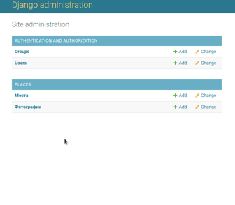
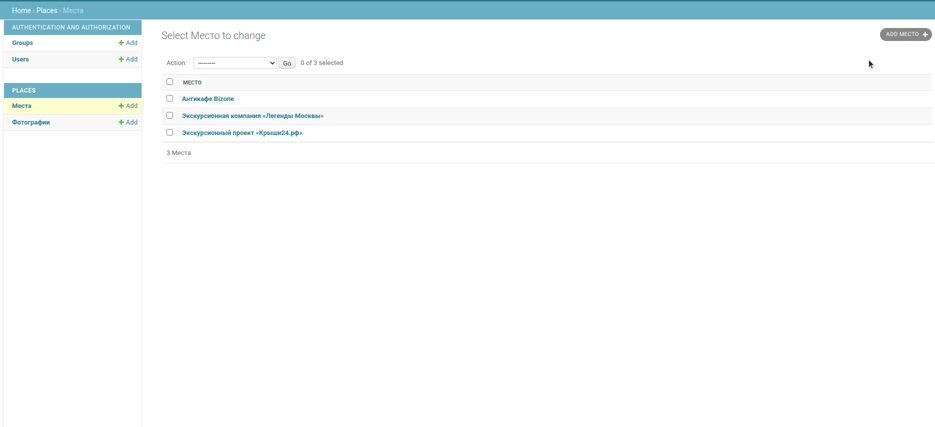
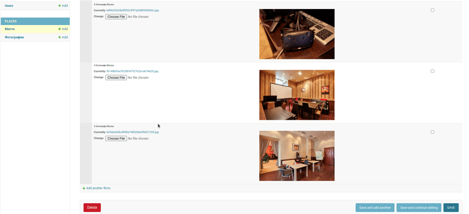

## Сайт "Куда пойти — Москва глазами Артёма"

Сайт с метками и описанием самых интересных мест в Москве. Авторский проект Артёма.

[Пример запуска сайта](/http://shirlex.pythonanywhere.com/)

[Пример админ-панели](http://shirlex.pythonanywhere.com/admin/)

## Запуск

- Скачайте репозиторий с Github:

```
git clone https://github.com/Shirlusha/where_to_go.git
```


- Установите зависимости командой `pip install -r requirements.txt`
- Создайте файл `.env` и внесите в него переменные окружения. Для тестирования работоспособности, код работает и без их
  заполнения.
- Создайте файл базы данных и сразу примените все миграции командой `python3 manage.py migrate`
- Запустите сервер командой `python3 manage.py runserver`
- Загрузите нужные вам локации запуском скрипта `load_place`, в качестве обязательного аргумента - полная ссылка на
  файл с данными локации, к примеру:

```
python3 manage.py load_place https://raw.githubusercontent.com/devmanorg/where-to-go-places/master/places/%D0%90%D0%BD%D1%82%D0%B8%D0%BA%D0%B0%D1%84%D0%B5%20Bizone.json

```

## Пример использования сайта

Карта позволяет изменять масштаб, показывает описание и фото локации, а также по некоторым локациям можно пройти по
ссылкам на сайт или соцсети данной локации


## Работа с админ-панелью

Для тестирования админ-панели можно перейти по [ссылке](http://shirlex.pythonanywhere.com/admin/) и ввести уже готовые
логин и пароль:

**Username:** `admin123`

**Password:** `Password321@`

Для дальнейшего создания своего пользователя на локальной машине, воспользуйтесь командой:

```
python3 manage.py createsuperuser
```

Залогинившись в админ-панели, можно создать новую или отредактировать старую локацию, нажав на **Места**



Для создания новой локации, нажмите **Add Место**



В режиме редактирования можно менять текст, координаты локаций, добавлять и удалять фотографии, а также менять их
положение при отображении на сайте, путем перетаскивания фоток курсором мышки:


## Переменные окружения

Часть настроек проекта берётся из переменных окружения. Чтобы их определить, создайте файл `.env` рядом с `manage.py` и
запишите туда данные в таком формате: `ПЕРЕМЕННАЯ=значение`.

Доступны переменные:

- `DEBUG` — дебаг-режим. Поставьте True, чтобы увидеть отладочную информацию в случае ошибки.
- `SECRET_KEY` — секретный ключ проекта
- `ALLOWED_HOSTS` — смотри [документацию Django](https://docs.djangoproject.com/en/3.2/ref/settings/#allowed-hosts).
- `STATIC_URL`
  — [смотри документацию Django, по умолчанию 'places/static/'](https://docs.djangoproject.com/en/3.2/ref/settings/#static-url)
- `STATIC_ROOT`
  — [смотри документацию Django, по умолчанию None](https://docs.djangoproject.com/en/3.2/ref/settings/#static-root)
- `MEDIA_URL`
  — [смотри документацию Django, по умолчанию /media/'](https://docs.djangoproject.com/en/3.2/ref/settings/#std:setting-MEDIA_URL)
- `MEDIA_ROOT`
  — [смотри документацию Django, по умолчанию 'media'](https://docs.djangoproject.com/en/3.2/ref/settings/#std:setting-MEDIA_ROOT)

## Цели проекта

Код написан в учебных целях — это урок в курсе по Python и веб-разработке на сайте [Devman](https://dvmn.org).

Тестовые данные взяты с сайта [KudaGo](https://kudago.com).
